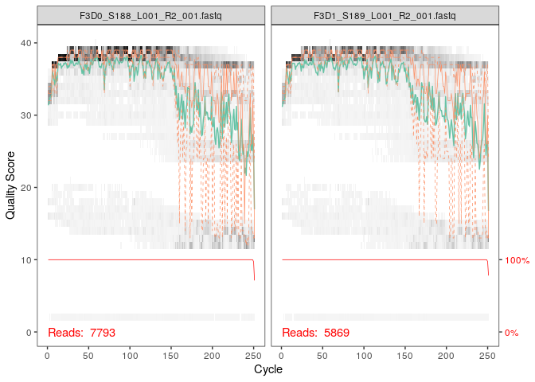
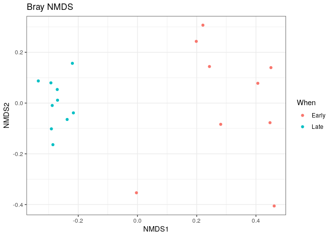

CC1_DADA2_QuentinMarais
================
Quentin Marais

# Installation du package “dada2”

``` r
library(dada2)
```

    ## Loading required package: Rcpp

# Chargement du jeu de données

``` r
path <- "~/tutoriel_ADM/MiSeq_SOP"
list.files(path)
```

    ##  [1] "F3D0_S188_L001_R1_001.fastq"   "F3D0_S188_L001_R2_001.fastq"  
    ##  [3] "F3D1_S189_L001_R1_001.fastq"   "F3D1_S189_L001_R2_001.fastq"  
    ##  [5] "F3D141_S207_L001_R1_001.fastq" "F3D141_S207_L001_R2_001.fastq"
    ##  [7] "F3D142_S208_L001_R1_001.fastq" "F3D142_S208_L001_R2_001.fastq"
    ##  [9] "F3D143_S209_L001_R1_001.fastq" "F3D143_S209_L001_R2_001.fastq"
    ## [11] "F3D144_S210_L001_R1_001.fastq" "F3D144_S210_L001_R2_001.fastq"
    ## [13] "F3D145_S211_L001_R1_001.fastq" "F3D145_S211_L001_R2_001.fastq"
    ## [15] "F3D146_S212_L001_R1_001.fastq" "F3D146_S212_L001_R2_001.fastq"
    ## [17] "F3D147_S213_L001_R1_001.fastq" "F3D147_S213_L001_R2_001.fastq"
    ## [19] "F3D148_S214_L001_R1_001.fastq" "F3D148_S214_L001_R2_001.fastq"
    ## [21] "F3D149_S215_L001_R1_001.fastq" "F3D149_S215_L001_R2_001.fastq"
    ## [23] "F3D150_S216_L001_R1_001.fastq" "F3D150_S216_L001_R2_001.fastq"
    ## [25] "F3D2_S190_L001_R1_001.fastq"   "F3D2_S190_L001_R2_001.fastq"  
    ## [27] "F3D3_S191_L001_R1_001.fastq"   "F3D3_S191_L001_R2_001.fastq"  
    ## [29] "F3D5_S193_L001_R1_001.fastq"   "F3D5_S193_L001_R2_001.fastq"  
    ## [31] "F3D6_S194_L001_R1_001.fastq"   "F3D6_S194_L001_R2_001.fastq"  
    ## [33] "F3D7_S195_L001_R1_001.fastq"   "F3D7_S195_L001_R2_001.fastq"  
    ## [35] "F3D8_S196_L001_R1_001.fastq"   "F3D8_S196_L001_R2_001.fastq"  
    ## [37] "F3D9_S197_L001_R1_001.fastq"   "F3D9_S197_L001_R2_001.fastq"  
    ## [39] "filtered"                      "HMP_MOCK.v35.fasta"           
    ## [41] "Mock_S280_L001_R1_001.fastq"   "Mock_S280_L001_R2_001.fastq"  
    ## [43] "mouse.dpw.metadata"            "mouse.time.design"            
    ## [45] "stability.batch"               "stability.files"

# Créaton des listes pour les fichiers Forward (fnFs) et Reverse (fnRs)

``` r
fnFs <- sort(list.files(path, pattern="_R1_001.fastq", full.names = TRUE))
fnRs <- sort(list.files(path, pattern="_R2_001.fastq", full.names = TRUE))
```

# Extraction du nom de chaque échantillon des fichiers

``` r
sample.names <- sapply(strsplit(basename(fnFs), "_"), `[`, 1)
```

# Visualisation des profils de qualité des reads

## Qualité de la lecture Forward

``` r
plotQualityProfile(fnFs[1:2])
```

<!-- -->

Le but de cette étape est de visualiser la qualité de lecture des
nucléotides des reads.

- En gris : La fréquence de chaque score de qualité pour chaque
  position.
- La ligne verte : La moyenne du score de qualité pour chaque position.
- La ligne orange : Les quartiles montrant la variabilité de la qualité.
- La ligne rouge : La proportion de lectures qui atteignent cette
  position.

Dans ce cas, on remarque que la qualité de mes reads en lecture Forward
est bonne.

## Qualité de la lecture Reverse

``` r
plotQualityProfile(fnRs[1:2])
```

<!-- --> Ici, on
remarque directement que la qualité de lecture des reads est moins bonne
que pour la lecture forward. Ce phénomène est connu en séquençage
Illumina et se traite informatiquement grâce à la pipeline dada2. Ce
score de qualité moins bon en Reverse est dû à une combinaison de
facteurs comme la perte de processivité de l’ADN polymérase ou encore la
diminution du rapport signal/bruit due à la chimie du séquençage.

# Filtration

``` r
filtFs <- file.path(path, "filtered", paste0(sample.names, "_F_filt.fastq.gz"))
filtRs <- file.path(path, "filtered", paste0(sample.names, "_R_filt.fastq.gz"))
names(filtFs) <- sample.names
names(filtRs) <- sample.names
```

On relie noms des fichiers et noms des échantillons.

## Filtration et pré-traitement des reads

``` r
out <- filterAndTrim(fnFs, filtFs, fnRs, filtRs, truncLen=c(240,160),
              maxN=0, maxEE=c(2,2), truncQ=2, rm.phix=TRUE,
              compress=TRUE, multithread=FALSE) 
head(out)
```

    ##                               reads.in reads.out
    ## F3D0_S188_L001_R1_001.fastq       7793      7113
    ## F3D1_S189_L001_R1_001.fastq       5869      5299
    ## F3D141_S207_L001_R1_001.fastq     5958      5463
    ## F3D142_S208_L001_R1_001.fastq     3183      2914
    ## F3D143_S209_L001_R1_001.fastq     3178      2941
    ## F3D144_S210_L001_R1_001.fastq     4827      4312

Le tableau nous montre le nombre de reads avant (reads.in) et après
(reads.out) filtration. On remarque que la majorité des séquences a été
conservée.

# Taux d’erreur de séquençage

Il arrive relativement régulièrement que des reads contiennent des
erreurs de séquençage. La pipeline dada2 nous permet alors de
discriminer les séquences qui existent réellement, des séquences
contenant des erreurs de séquençage.

``` r
errF <- learnErrors(filtFs, multithread=TRUE)
```

    ## 33514080 total bases in 139642 reads from 20 samples will be used for learning the error rates.

``` r
errR <- learnErrors(filtRs, multithread=TRUE)
```

    ## 22342720 total bases in 139642 reads from 20 samples will be used for learning the error rates.

# Visualisation des taux d’erreur

``` r
plotErrors(errF, nominalQ=TRUE)
```

    ## Warning: Transformation introduced infinite values in continuous y-axis
    ## Transformation introduced infinite values in continuous y-axis

<!-- --> Ici, la
ligne noire représente le taux d’erreur estimé par l’algorithme. En
rouge sont annotés les taux d’erreurs effectivement observés. Enfin la
ligne rouge correspond au taux d’erreur attendu selon le Q score.

On remarque que, les points rouges suivent en effet la ligne noire. La
réalité semble suivre l’estimation. On observe également que plus le Q
score augmente, plus le taux d’erreur diminue. Ceci étant attendu.

# Algorithme de la pipeline dada2 : Correction ou identification

## Sur les reads Foward

``` r
dadaFs <- dada(filtFs, err=errF, multithread=TRUE)
```

    ## Sample 1 - 7113 reads in 1979 unique sequences.
    ## Sample 2 - 5299 reads in 1639 unique sequences.
    ## Sample 3 - 5463 reads in 1477 unique sequences.
    ## Sample 4 - 2914 reads in 904 unique sequences.
    ## Sample 5 - 2941 reads in 939 unique sequences.
    ## Sample 6 - 4312 reads in 1267 unique sequences.
    ## Sample 7 - 6741 reads in 1756 unique sequences.
    ## Sample 8 - 4560 reads in 1438 unique sequences.
    ## Sample 9 - 15637 reads in 3590 unique sequences.
    ## Sample 10 - 11413 reads in 2762 unique sequences.
    ## Sample 11 - 12017 reads in 3021 unique sequences.
    ## Sample 12 - 5032 reads in 1566 unique sequences.
    ## Sample 13 - 18075 reads in 3707 unique sequences.
    ## Sample 14 - 6250 reads in 1479 unique sequences.
    ## Sample 15 - 4052 reads in 1195 unique sequences.
    ## Sample 16 - 7369 reads in 1832 unique sequences.
    ## Sample 17 - 4765 reads in 1183 unique sequences.
    ## Sample 18 - 4871 reads in 1382 unique sequences.
    ## Sample 19 - 6504 reads in 1709 unique sequences.
    ## Sample 20 - 4314 reads in 897 unique sequences.

Ici, l’algorithme compare la séquence observée au modèle d’erreur pour
chacun des reads. Puis il corrige les reads en tenant compte des
probabilités d’erreur. Si la différence observée peut être expliquée par
une erreur de séquençage, alors le read est corrigé. Mais, si la
différence ne peut pas être expliquée par la seule erreur de séquençage
(càd que la différence est trop grande), le read sera considéré comme un
variant biologique (ASV).

## Sur les reads Reverse

``` r
dadaRs <- dada(filtRs, err=errR, multithread=TRUE)
```

    ## Sample 1 - 7113 reads in 1660 unique sequences.
    ## Sample 2 - 5299 reads in 1349 unique sequences.
    ## Sample 3 - 5463 reads in 1335 unique sequences.
    ## Sample 4 - 2914 reads in 853 unique sequences.
    ## Sample 5 - 2941 reads in 880 unique sequences.
    ## Sample 6 - 4312 reads in 1286 unique sequences.
    ## Sample 7 - 6741 reads in 1803 unique sequences.
    ## Sample 8 - 4560 reads in 1265 unique sequences.
    ## Sample 9 - 15637 reads in 3414 unique sequences.
    ## Sample 10 - 11413 reads in 2522 unique sequences.
    ## Sample 11 - 12017 reads in 2771 unique sequences.
    ## Sample 12 - 5032 reads in 1415 unique sequences.
    ## Sample 13 - 18075 reads in 3290 unique sequences.
    ## Sample 14 - 6250 reads in 1390 unique sequences.
    ## Sample 15 - 4052 reads in 1134 unique sequences.
    ## Sample 16 - 7369 reads in 1635 unique sequences.
    ## Sample 17 - 4765 reads in 1084 unique sequences.
    ## Sample 18 - 4871 reads in 1161 unique sequences.
    ## Sample 19 - 6504 reads in 1502 unique sequences.
    ## Sample 20 - 4314 reads in 732 unique sequences.

# Résultats : visualisation d’un exemple

``` r
dadaFs[[1]]
```

    ## dada-class: object describing DADA2 denoising results
    ## 128 sequence variants were inferred from 1979 input unique sequences.
    ## Key parameters: OMEGA_A = 1e-40, OMEGA_C = 1e-40, BAND_SIZE = 16

Pour le 1er échantillon, l’algorithme a identifié 128 variants
biologiques au sein des 1979 reads.

# Fusion des reads appariés

``` r
mergers <- mergePairs(dadaFs, filtFs, dadaRs, filtRs, verbose=TRUE)
```

    ## 6540 paired-reads (in 107 unique pairings) successfully merged out of 6891 (in 197 pairings) input.

    ## 5028 paired-reads (in 101 unique pairings) successfully merged out of 5190 (in 157 pairings) input.

    ## 4986 paired-reads (in 81 unique pairings) successfully merged out of 5267 (in 166 pairings) input.

    ## 2595 paired-reads (in 52 unique pairings) successfully merged out of 2754 (in 108 pairings) input.

    ## 2553 paired-reads (in 60 unique pairings) successfully merged out of 2785 (in 119 pairings) input.

    ## 3646 paired-reads (in 55 unique pairings) successfully merged out of 4109 (in 157 pairings) input.

    ## 6079 paired-reads (in 81 unique pairings) successfully merged out of 6514 (in 198 pairings) input.

    ## 3968 paired-reads (in 91 unique pairings) successfully merged out of 4388 (in 187 pairings) input.

    ## 14233 paired-reads (in 143 unique pairings) successfully merged out of 15355 (in 352 pairings) input.

    ## 10528 paired-reads (in 120 unique pairings) successfully merged out of 11165 (in 278 pairings) input.

    ## 11154 paired-reads (in 137 unique pairings) successfully merged out of 11797 (in 298 pairings) input.

    ## 4349 paired-reads (in 85 unique pairings) successfully merged out of 4802 (in 179 pairings) input.

    ## 17431 paired-reads (in 153 unique pairings) successfully merged out of 17812 (in 272 pairings) input.

    ## 5850 paired-reads (in 81 unique pairings) successfully merged out of 6095 (in 159 pairings) input.

    ## 3716 paired-reads (in 86 unique pairings) successfully merged out of 3894 (in 147 pairings) input.

    ## 6865 paired-reads (in 99 unique pairings) successfully merged out of 7191 (in 187 pairings) input.

    ## 4426 paired-reads (in 67 unique pairings) successfully merged out of 4603 (in 127 pairings) input.

    ## 4576 paired-reads (in 101 unique pairings) successfully merged out of 4739 (in 174 pairings) input.

    ## 6092 paired-reads (in 109 unique pairings) successfully merged out of 6315 (in 173 pairings) input.

    ## 4269 paired-reads (in 20 unique pairings) successfully merged out of 4281 (in 28 pairings) input.

``` r
# Inspect the merger data.frame from the first sample
head(mergers[[1]])
```

    ##                                                                                                                                                                                                                                                       sequence
    ## 1 TACGGAGGATGCGAGCGTTATCCGGATTTATTGGGTTTAAAGGGTGCGCAGGCGGAAGATCAAGTCAGCGGTAAAATTGAGAGGCTCAACCTCTTCGAGCCGTTGAAACTGGTTTTCTTGAGTGAGCGAGAAGTATGCGGAATGCGTGGTGTAGCGGTGAAATGCATAGATATCACGCAGAACTCCGATTGCGAAGGCAGCATACCGGCGCTCAACTGACGCTCATGCACGAAAGTGTGGGTATCGAACAGG
    ## 2 TACGGAGGATGCGAGCGTTATCCGGATTTATTGGGTTTAAAGGGTGCGTAGGCGGCCTGCCAAGTCAGCGGTAAAATTGCGGGGCTCAACCCCGTACAGCCGTTGAAACTGCCGGGCTCGAGTGGGCGAGAAGTATGCGGAATGCGTGGTGTAGCGGTGAAATGCATAGATATCACGCAGAACCCCGATTGCGAAGGCAGCATACCGGCGCCCTACTGACGCTGAGGCACGAAAGTGCGGGGATCAAACAGG
    ## 3 TACGGAGGATGCGAGCGTTATCCGGATTTATTGGGTTTAAAGGGTGCGTAGGCGGGCTGTTAAGTCAGCGGTCAAATGTCGGGGCTCAACCCCGGCCTGCCGTTGAAACTGGCGGCCTCGAGTGGGCGAGAAGTATGCGGAATGCGTGGTGTAGCGGTGAAATGCATAGATATCACGCAGAACTCCGATTGCGAAGGCAGCATACCGGCGCCCGACTGACGCTGAGGCACGAAAGCGTGGGTATCGAACAGG
    ## 4 TACGGAGGATGCGAGCGTTATCCGGATTTATTGGGTTTAAAGGGTGCGTAGGCGGGCTTTTAAGTCAGCGGTAAAAATTCGGGGCTCAACCCCGTCCGGCCGTTGAAACTGGGGGCCTTGAGTGGGCGAGAAGAAGGCGGAATGCGTGGTGTAGCGGTGAAATGCATAGATATCACGCAGAACCCCGATTGCGAAGGCAGCCTTCCGGCGCCCTACTGACGCTGAGGCACGAAAGTGCGGGGATCGAACAGG
    ## 5 TACGGAGGATGCGAGCGTTATCCGGATTTATTGGGTTTAAAGGGTGCGCAGGCGGACTCTCAAGTCAGCGGTCAAATCGCGGGGCTCAACCCCGTTCCGCCGTTGAAACTGGGAGCCTTGAGTGCGCGAGAAGTAGGCGGAATGCGTGGTGTAGCGGTGAAATGCATAGATATCACGCAGAACTCCGATTGCGAAGGCAGCCTACCGGCGCGCAACTGACGCTCATGCACGAAAGCGTGGGTATCGAACAGG
    ## 6 TACGGAGGATGCGAGCGTTATCCGGATTTATTGGGTTTAAAGGGTGCGTAGGCGGGATGCCAAGTCAGCGGTAAAAAAGCGGTGCTCAACGCCGTCGAGCCGTTGAAACTGGCGTTCTTGAGTGGGCGAGAAGTATGCGGAATGCGTGGTGTAGCGGTGAAATGCATAGATATCACGCAGAACTCCGATTGCGAAGGCAGCATACCGGCGCCCTACTGACGCTGAGGCACGAAAGCGTGGGTATCGAACAGG
    ##   abundance forward reverse nmatch nmismatch nindel prefer accept
    ## 1       579       1       1    148         0      0      1   TRUE
    ## 2       470       2       2    148         0      0      2   TRUE
    ## 3       449       3       4    148         0      0      1   TRUE
    ## 4       430       4       3    148         0      0      2   TRUE
    ## 5       345       5       6    148         0      0      1   TRUE
    ## 6       282       6       5    148         0      0      2   TRUE

Cette commande nous permet de visualiser les séquences les plus
abondantes dans l’échantillon.

# Construction d’une table contenant les séquences

``` r
seqtab <- makeSequenceTable(mergers)
dim(seqtab)
```

    ## [1]  20 293

Cette table contient les séquences fusionnées avec, en lignes les
échantillons, en colonnes les ASVs. Les valeurs contenues correspondent
à l’abondance des séquences. La commande dim() permet de retourner la
matrice de longueur 2. Le premier chiffre correspond au nombre
d’échantillon (20), et le second au nombre d’ASV (293).

# Distribution des longueurs des reads

``` r
table(nchar(getSequences(seqtab)))
```

    ## 
    ## 251 252 253 254 255 
    ##   1  88 196   6   2

On observe que : - 1 seule séquence a une longueur de 251 nucléotides. -
88 reads ont une longueur de 252 nucléotides. - 196 reads ont une
longueur de 253 nucléotides. - 6 reads ont une longueur de 254
nucléotides. - 2 reads ont une longueur de 255 nucléotides.

# Suppression des chimères

Une séquence est dite chimérique lorsqu’elle est formée de deux
fragments d’ADN qui s’hybrident partiellement et sont reconnus et
amplifiés comme étant une seule et même séquence.

``` r
seqtab.nochim <- removeBimeraDenovo(seqtab, method="consensus", multithread=TRUE, verbose=TRUE)
```

    ## Identified 61 bimeras out of 293 input sequences.

``` r
dim(seqtab.nochim)
```

    ## [1]  20 232

Dans ce cas, on retrouve 61 séquences chimériques.

# Proportion de reads ayant passé la filtration des chimères

``` r
sum(seqtab.nochim)/sum(seqtab)
```

    ## [1] 0.9640374

Ici, on remarque que 96,4% des séquences ont été conservées après
filtration des chimères.

# Suivi des reads au sein de la pipeline

``` r
getN <- function(x) sum(getUniques(x))
track <- cbind(out, sapply(dadaFs, getN), sapply(dadaRs, getN), sapply(mergers, getN), rowSums(seqtab.nochim))
# If processing a single sample, remove the sapply calls: e.g. replace sapply(dadaFs, getN) with getN(dadaFs)
colnames(track) <- c("input", "filtered", "denoisedF", "denoisedR", "merged", "nonchim")
rownames(track) <- sample.names
head(track)
```

    ##        input filtered denoisedF denoisedR merged nonchim
    ## F3D0    7793     7113      6976      6979   6540    6528
    ## F3D1    5869     5299      5227      5239   5028    5017
    ## F3D141  5958     5463      5331      5357   4986    4863
    ## F3D142  3183     2914      2799      2830   2595    2521
    ## F3D143  3178     2941      2822      2868   2553    2519
    ## F3D144  4827     4312      4151      4228   3646    3507

Ces commandes permettent de visualiser et de retracer le chemin des
reads à travers la pipeline dada2. On observe une perte d’information
dues aux filtrations, ce qui est tout à fait normal.

# Assignations taxonomiques

Nous arrivons à l’étape de comparaison de nos ASVs à une base de données
de références afin de leur attribuer une taxonomie.

``` r
taxa <- assignTaxonomy(seqtab.nochim, "~/tutoriel_ADM/silva_nr99_v138.2_toGenus_trainset.fa.gz?download=1", multithread=TRUE)
```

``` r
taxa.print <- taxa # Removing sequence rownames for display only
rownames(taxa.print) <- NULL
head(taxa.print)
```

    ##      Kingdom    Phylum         Class         Order           Family          
    ## [1,] "Bacteria" "Bacteroidota" "Bacteroidia" "Bacteroidales" "Muribaculaceae"
    ## [2,] "Bacteria" "Bacteroidota" "Bacteroidia" "Bacteroidales" "Muribaculaceae"
    ## [3,] "Bacteria" "Bacteroidota" "Bacteroidia" "Bacteroidales" "Muribaculaceae"
    ## [4,] "Bacteria" "Bacteroidota" "Bacteroidia" "Bacteroidales" "Muribaculaceae"
    ## [5,] "Bacteria" "Bacteroidota" "Bacteroidia" "Bacteroidales" "Bacteroidaceae"
    ## [6,] "Bacteria" "Bacteroidota" "Bacteroidia" "Bacteroidales" "Muribaculaceae"
    ##      Genus        
    ## [1,] NA           
    ## [2,] NA           
    ## [3,] NA           
    ## [4,] NA           
    ## [5,] "Bacteroides"
    ## [6,] NA

On observe que, le phylum assigné majoritairement dans nos échantillons
est celui des Bacteroidota. Pour certains, l’assignation a été jusqu’à
la Famille où l’on retrouve deux représentants principaux :
Muribaculaceae et Bacteroidaceae.

# Evaluation de la précision de l’assignation

## Echantillon de contrôle “Mock”

``` r
unqs.mock <- seqtab.nochim["Mock",]
unqs.mock <- sort(unqs.mock[unqs.mock>0], decreasing=TRUE) # Drop ASVs absent in the Mock
cat("DADA2 inferred", length(unqs.mock), "sample sequences present in the Mock community.\n")
```

    ## DADA2 inferred 20 sample sequences present in the Mock community.

Ces commandes permettent de vérifier la précision et la sensibilité de
la pipeline dada2 grâce à l’échantillon contrôle “Mock” connu.

Dans ce cas, on remarque que 20 séquences ont été détectées dans la
communauté Mock.

``` r
mock.ref <- getSequences(file.path(path, "HMP_MOCK.v35.fasta"))
match.ref <- sum(sapply(names(unqs.mock), function(x) any(grepl(x, mock.ref))))
cat("Of those,", sum(match.ref), "were exact matches to the expected reference sequences.\n")
```

    ## Of those, 20 were exact matches to the expected reference sequences.

Sur ces 20 séquences, 20 correspondent précisemment aux séquences
connues de Mock. Cela signifie que la pipeline n’a pas introduit de
contaminant et que les résultats sur les autres séquences étudiées non
contrôles, pourront être interprétés scientifiquement.

# Conclusion globale

On peut conclure que le suivi de la pipeline dada2 nous a permis
d’estimer la qualité de nos séquences brutes et de les nettoyer. Puis,
nous avons pu estimer les erreurs de séquençage, les détecter et les
corriger. Cette étape nous a permis également d’identifier les variants
biologiques (ASVs). Après fusion des reads (séquences complètes), et
détection des chimères, nous avons créé une table de comptage des ASVs.
Finalement, la pipeline dada2 nous a permis de réaliser une assignation
taxonique qui pourra être interprétée écologiquement.

# Partie phyloseq (optionnelle)

## non commentée

``` r
library(phyloseq)
packageVersion("phyloseq")
```

    ## [1] '1.44.0'

``` r
library(Biostrings); packageVersion("Biostrings")
```

    ## Loading required package: BiocGenerics

    ## 
    ## Attaching package: 'BiocGenerics'

    ## The following objects are masked from 'package:stats':
    ## 
    ##     IQR, mad, sd, var, xtabs

    ## The following objects are masked from 'package:base':
    ## 
    ##     anyDuplicated, aperm, append, as.data.frame, basename, cbind,
    ##     colnames, dirname, do.call, duplicated, eval, evalq, Filter, Find,
    ##     get, grep, grepl, intersect, is.unsorted, lapply, Map, mapply,
    ##     match, mget, order, paste, pmax, pmax.int, pmin, pmin.int,
    ##     Position, rank, rbind, Reduce, rownames, sapply, setdiff, sort,
    ##     table, tapply, union, unique, unsplit, which.max, which.min

    ## Loading required package: S4Vectors

    ## Loading required package: stats4

    ## 
    ## Attaching package: 'S4Vectors'

    ## The following object is masked from 'package:utils':
    ## 
    ##     findMatches

    ## The following objects are masked from 'package:base':
    ## 
    ##     expand.grid, I, unname

    ## Loading required package: IRanges

    ## 
    ## Attaching package: 'IRanges'

    ## The following object is masked from 'package:phyloseq':
    ## 
    ##     distance

    ## Loading required package: XVector

    ## Loading required package: GenomeInfoDb

    ## 
    ## Attaching package: 'Biostrings'

    ## The following object is masked from 'package:base':
    ## 
    ##     strsplit

    ## [1] '2.68.1'

``` r
library(ggplot2); packageVersion("ggplot2")
```

    ## [1] '3.4.3'

``` r
theme_set(theme_bw())
```

``` r
samples.out <- rownames(seqtab.nochim)
subject <- sapply(strsplit(samples.out, "D"), `[`, 1)
gender <- substr(subject,1,1)
subject <- substr(subject,2,999)
day <- as.integer(sapply(strsplit(samples.out, "D"), `[`, 2))
samdf <- data.frame(Subject=subject, Gender=gender, Day=day)
samdf$When <- "Early"
samdf$When[samdf$Day>100] <- "Late"
rownames(samdf) <- samples.out
```

``` r
ps <- phyloseq(otu_table(seqtab.nochim, taxa_are_rows=FALSE), 
               sample_data(samdf), 
               tax_table(taxa))
ps <- prune_samples(sample_names(ps) != "Mock", ps) # Remove mock sample
```

``` r
dna <- Biostrings::DNAStringSet(taxa_names(ps))
names(dna) <- taxa_names(ps)
ps <- merge_phyloseq(ps, dna)
taxa_names(ps) <- paste0("ASV", seq(ntaxa(ps)))
ps
```

    ## phyloseq-class experiment-level object
    ## otu_table()   OTU Table:         [ 232 taxa and 19 samples ]
    ## sample_data() Sample Data:       [ 19 samples by 4 sample variables ]
    ## tax_table()   Taxonomy Table:    [ 232 taxa by 6 taxonomic ranks ]
    ## refseq()      DNAStringSet:      [ 232 reference sequences ]

``` r
plot_richness(ps, x="Day", measures=c("Shannon", "Simpson"), color="When")
```

    ## Warning in estimate_richness(physeq, split = TRUE, measures = measures): The data you have provided does not have
    ## any singletons. This is highly suspicious. Results of richness
    ## estimates (for example) are probably unreliable, or wrong, if you have already
    ## trimmed low-abundance taxa from the data.
    ## 
    ## We recommended that you find the un-trimmed data and retry.

<!-- -->

``` r
# Transform data to proportions as appropriate for Bray-Curtis distances
ps.prop <- transform_sample_counts(ps, function(otu) otu/sum(otu))
ord.nmds.bray <- ordinate(ps.prop, method="NMDS", distance="bray")
```

    ## Run 0 stress 0.08043117 
    ## Run 1 stress 0.1327107 
    ## Run 2 stress 0.08076336 
    ## ... Procrustes: rmse 0.01048173  max resid 0.03225423 
    ## Run 3 stress 0.1297738 
    ## Run 4 stress 0.08076337 
    ## ... Procrustes: rmse 0.01047682  max resid 0.03223878 
    ## Run 5 stress 0.08043117 
    ## ... New best solution
    ## ... Procrustes: rmse 3.566876e-06  max resid 1.000167e-05 
    ## ... Similar to previous best
    ## Run 6 stress 0.08076337 
    ## ... Procrustes: rmse 0.01050888  max resid 0.03234118 
    ## Run 7 stress 0.08076338 
    ## ... Procrustes: rmse 0.01052776  max resid 0.03240364 
    ## Run 8 stress 0.09477182 
    ## Run 9 stress 0.08076337 
    ## ... Procrustes: rmse 0.01051287  max resid 0.0323543 
    ## Run 10 stress 0.08616061 
    ## Run 11 stress 0.1010629 
    ## Run 12 stress 0.1228545 
    ## Run 13 stress 0.09477103 
    ## Run 14 stress 0.1212044 
    ## Run 15 stress 0.08076336 
    ## ... Procrustes: rmse 0.0104852  max resid 0.0322639 
    ## Run 16 stress 0.08616061 
    ## Run 17 stress 0.1274324 
    ## Run 18 stress 0.08076337 
    ## ... Procrustes: rmse 0.01052049  max resid 0.03237913 
    ## Run 19 stress 0.1228545 
    ## Run 20 stress 0.0807634 
    ## ... Procrustes: rmse 0.01056226  max resid 0.03251611 
    ## *** Best solution repeated 1 times

``` r
plot_ordination(ps.prop, ord.nmds.bray, color="When", title="Bray NMDS")
```

<!-- -->

``` r
top20 <- names(sort(taxa_sums(ps), decreasing=TRUE))[1:20]
ps.top20 <- transform_sample_counts(ps, function(OTU) OTU/sum(OTU))
ps.top20 <- prune_taxa(top20, ps.top20)
plot_bar(ps.top20, x="Day", fill="Family") + facet_wrap(~When, scales="free_x")
```

<!-- -->
